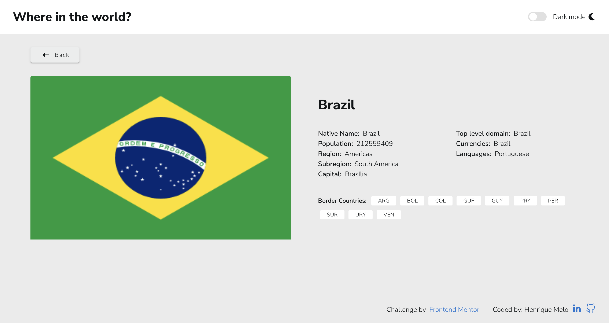

# Frontend Mentor - REST Countries API with color theme switcher solution

This is a solution to the [REST Countries API with color theme switcher challenge on Frontend Mentor](https://www.frontendmentor.io/challenges/rest-countries-api-with-color-theme-switcher-5cacc469fec04111f7b848ca).

## Table of contents

- [Frontend Mentor - REST Countries API with color theme switcher solution](#frontend-mentor---rest-countries-api-with-color-theme-switcher-solution)
  - [Table of contents](#table-of-contents)
  - [Overview](#overview)
    - [The challenge](#the-challenge)
    - [Screenshot](#screenshot)
    - [Links](#links)
  - [My process](#my-process)
    - [Built with](#built-with)
    - [What I learned](#what-i-learned)
    - [Continued development](#continued-development)
  - [Author](#author)

## Overview

### The challenge

Users should be able to:

- See all countries from the API on the homepage
- Search for a country using an `input` field
- Filter countries by region
- Click on a country to see more detailed information on a separate page
- Click through to the border countries on the detail page
- Toggle the color scheme between light and dark mode *(optional)*

### Screenshot





### Links

- Solution URL: [GitHub](https://github.com/HenriqueAmorim20/countries-challenge)
- Live Site URL: [Web](https://master.d2drl4y7ebnpeb.amplifyapp.com)

## My process

### Built with

- Semantic HTML5 markup
- CSS custom properties
- Flexbox
- CSS Grid
- Mobile-first workflow
- [VueJS](https://vuejs.org/) - JS library
- [Nuxt.js](https://nuxtjs.org/) - VueJS framework
- [Vuetify](https://vuetifyjs.com/) - Material Design Framework

### What I learned

I learned more about consuming APIs, css grid, flexbox and more.

Code i'm proud of:

```html
<div v-if="!loading" class="countries">
  <Country
    v-for="country in countries"
    :key="country.name.common"
    :country="country"
    :dark-mode="darkMode"
    class="country"
  />
</div>
```
```css
.country-card-info {
  display: grid;
  grid-template-areas:
    "one"
    "two"
    "three"
    "four";
  gap: 2rem;
  margin: auto 0;
}

.country-card-info-top {
  grid-area: one;
}
.country-card-info-left {
  grid-area: two;
}
.country-card-info-right {
  grid-area: three;
}
.country-card-info-bottom {
  grid-area: four;
}

@media (min-width: 1000px) {
  .country-card-info {
    grid-template-areas:
      "one one"
      "two three"
      "four four";
  }
}
```
```js
getCurrencies() {
  let currencies = ""
  const currenciesArr =  Object.values(this.country.currencies)
  currenciesArr.forEach(currency => {
      currencies += currency.name + (currenciesArr.indexOf(currency) < currenciesArr.length - 1 ? ", " : '')
  });
  return currencies
}
```

### Continued development

 I want to keep improving my knowledge in CSS GRID , flexbox, media queries, Vue Store, js objects functions and more.

## Author

- Website - [Henrique Melo](https://www.melohenrique.com)
